# AI Health Companion Backend

Secure, AI-powered healthcare companion backend built with Python 3.12, FastAPI, Firestore, Firebase Auth, and Google Cloud Platform. 

Includes two microservices:
1. **Patient Service** (Port `8001`): Powers patient mobile apps (OTP sign-in, profile, health passport, ratings, medical documents).
2. **Doctor Service** (Port `8002`): Powers doctor web applications (clinical consults orchestration, voice recording transcriptions, AI-driven entity extraction, medication safety engine, analytics).

---

## Technical Stack & Infrastructure
- **Web Framework**: FastAPI (ASGI)
- **Database**: Google Cloud Firestore (Serverless document store)
- **Identity & Access Management**: Firebase Auth (RBAC Custom Claims `patient` / `doctor`)
- **Speech-to-Text**: Speech-to-Text v2 (Chirp model with speaker diarisation)
- **Generative AI**: Vertex AI Gemini API via `google-genai` SDK
- **OCR Engine**: Cloud Document AI / Vision OCR
- **Translation & TTS**: Google Cloud Translation API & Text-to-Speech API (Chirp 3 HD equivalent voices)
- **Pub/Sub event pipeline**: Decouples audio upload, transcription, and post-publish alarm routines asynchronously.

---

## System Architecture

The patient service is the sole deployed backend. All features are patient-facing — there is no doctor-side API in the current system.

```mermaid
flowchart TD
    %% ── Client ───────────────────────────────────────────────────────────────
    subgraph CLIENT["📱 Flutter Mobile App"]
        APP[Flutter Client]
    end

    %% ── Google Cloud Platform ────────────────────────────────────────────────
    subgraph GCP["☁️ Google Cloud Platform"]

        FBAUTH["🔐 Firebase Auth\nID Token Verification"]

        subgraph CR["Cloud Run · FastAPI Patient Service"]
            direction LR
            PROFILE["/profile · /vitals"]
            CONSULT["/consultations"]
            DOCEP["/documents"]
            REMIND["/reminders"]
            CHAT["/chatbot"]
            DASH["/dashboard"]
        end

        subgraph FS["🗄️ Cloud Firestore"]
            direction LR
            FPat[(patients)]
            FCons[(audio_consultations)]
            FDoc[(documents)]
            FRem[(reminders)]
            FVit[(vitals)]
            FVec[("Vector Search\ntext-embedding-004")]
        end

        GCS[("☁️ Cloud Storage\nAudio · Documents · TTS Cache")]
        CT["⏰ Cloud Tasks\nReminder Queue"]
        FCM["🔔 Firebase FCM\nPush Notifications"]
    end

    %% ── External AI Services ─────────────────────────────────────────────────
    subgraph AI["🤖 External AI Services"]
        SCRIBE["ElevenLabs Scribe\nSTT + Speaker Diarization\n10 Indian Languages"]
        TTS["ElevenLabs TTS\n10 Regional Voice IDs"]
        GEMINI["Gemini 2.5 Flash\nClinical Extraction · RAG\nChatbot · Role Inference · Embeddings"]
        DOCAI["Google Document AI\nMedical OCR"]
    end

    %% ── Auth Flow ────────────────────────────────────────────────────────────
    APP -->|"Bearer ID Token"| FBAUTH
    FBAUTH -->|"uid verified"| CR
    APP -->|"REST API calls"| CR

    %% ── GCS Direct Upload (bypasses Cloud Run) ───────────────────────────────
    APP -. "Direct upload\nvia signed URL" .-> GCS

    %% ── Consultation Pipeline ────────────────────────────────────────────────
    CONSULT -->|"Audio file URL"| SCRIBE
    SCRIBE -->|"Diarized transcript\n+ speaker labels"| CONSULT
    CONSULT -->|"Summary text + language"| TTS
    TTS -->|"MP3 — cached in GCS"| GCS

    %% ── Document Pipeline ────────────────────────────────────────────────────
    DOCEP -->|"PDF / image via GCS path"| DOCAI
    DOCAI -->|"OCR text"| DOCEP

    %% ── Gemini Calls ─────────────────────────────────────────────────────────
    CONSULT -->|"Transcript → extract diagnoses,\nmedicines, red flags, title"| GEMINI
    DOCEP   -->|"OCR text → extract summary,\nabnormal labs, red flags"| GEMINI
    CHAT    -->|"Question + RAG chunks\n→ grounded answer"| GEMINI
    GEMINI  -->|"Structured JSON + embeddings"| CONSULT
    GEMINI  -->|"Structured JSON + embeddings"| DOCEP
    GEMINI  -->|"Answer in patient language"| CHAT

    %% ── Vector Search (RAG) ──────────────────────────────────────────────────
    CONSULT -->|"Embed + store chunks"| FVec
    DOCEP   -->|"Embed + store chunks"| FVec
    CHAT    -->|"Query top-k similar chunks"| FVec

    %% ── Firestore CRUD ───────────────────────────────────────────────────────
    PROFILE -->|"Read / Write"| FPat
    PROFILE -->|"Read / Write"| FVit
    CONSULT -->|"Read / Write"| FCons
    DOCEP   -->|"Read / Write"| FDoc
    REMIND  -->|"Read / Write"| FRem
    DASH    -->|"3 parallel queries\nasyncio.gather"| FPat
    DASH    -->|"3 parallel queries\nasyncio.gather"| FRem
    DASH    -->|"3 parallel queries\nasyncio.gather"| FVit

    %% ── Reminder Trigger Loop (Cloud Tasks) ──────────────────────────────────
    REMIND -->|"Enqueue task at scheduled time"| CT
    CT     -->|"POST /trigger\nCloud Tasks secret header"| REMIND
    REMIND -->|"Send push notification"| FCM
    FCM    -->|"Push to device"| APP
```



### Key Design Decisions

| Decision | Detail |
|---|---|
| **Direct GCS upload** | Flutter uploads audio and documents directly to Cloud Storage via signed URLs — large files never pass through Cloud Run |
| **Reminder idempotency** | Cloud Tasks delivers at-least-once; a Firestore `@async_transactional` guard checks `last_triggered_at ± 5s` to prevent duplicate notifications |
| **RAG grounding** | Chatbot answers are sourced exclusively from the patient's own consultations and documents via Firestore Vector Search — no generic internet data |
| **TTS caching** | Generated audio is stored in GCS after the first request; repeat listens cost zero API calls |
| **Parallel dashboard reads** | `/dashboard` fires 3 Firestore queries concurrently via `asyncio.gather(return_exceptions=True)`; any single failure degrades gracefully |
| **Prompt injection mitigation** | All patient-supplied free text (document title, chat messages) is wrapped in delimiter tags before being included in Gemini prompts |
| **FCM token pruning** | On `UnregisteredError` from FCM, the stale token is deleted from Firestore using `DELETE_FIELD` |

---

## Directory Structure
```
AI-Health/
├── common_code/             # Shared library for both services
│   ├── config.py            # Central configurations & topic metadata
│   ├── firebase_auth.py     # Auth helper, JWT claim decoders
│   ├── firestore.py         # DB singletons, audit logger, FCM pushes
│   ├── gcp_clients.py       # Speech, storage, documentai, translation, TTS clients
│   ├── pubsub.py            # Pub/Sub publisher helpers
│   └── safety_engine.py     # Deterministic medication safety verification
├── patient_service/         # Patient Mobile App API
│   ├── auth/                # Patient registration & session
│   ├── profile/             # Profile, vitals tracking (Indian BMI standards)
│   ├── documents/           # Upload reports, OCR summaries
│   ├── reminders/           # Alarms (Breakfast, Lunch, Dinner relative)
│   ├── ratings/             # Post-consultation doctor feedback/averaging
│   ├── consultations/       # Read consultations, translate summary, listen audio
│   ├── chatbot/             # Retrieval Augmented Generation Q&A
│   ├── Dockerfile
│   ├── build.sh
│   └── run.sh
├── doctor_service/          # Doctor Web App API
│   ├── auth/                # Doctor registration
│   ├── patients/            # Patient lookup & OTP consent session gateway
│   ├── consultations/       # Consultation flow, report publisher, PDF renderer
│   ├── medication_safety/   # Check interactions, dosing, duplication, weight checks
│   ├── chatbot/             # Contextual AI assistant scoped to patient record
│   ├── analytics/           # De-identified regional population health maps
│   ├── Dockerfile
│   ├── build.sh
│   └── run.sh
├── docker-compose.yml       # Orchestrates local stack setup
├── run_local.sh             # Interactive helper to run services or verify imports
├── setup_gcp.sh             # Auto-provisions buckets, service accounts, topics, permissions
└── verify_imports.py        # Import and schema compiler verification suite
```

---

## Local Setup & Development

### 1. Requirements
Ensure you have the following installed:
- [Docker](https://www.docker.com/) & [Docker Compose](https://docs.docker.com/compose/)
- [Google Cloud SDK (gcloud)](https://cloud.google.com/sdk/docs/install)
- Python 3.12+ (if running bare metal)
- [uv](https://github.com/astral-sh/uv) (fast Python package manager)

### 2. Environment Configurations
Copy `.env.example` to `.env`:
```bash
cp .env.example .env
```
Update parameters inside `.env` including your `GEMINI_API_KEY` (if testing without GCP credentials locally).

### 3. Running Services
Start services using the interactive local runner:
```bash
./run_local.sh
```
Or start via Docker Compose directly:
```bash
docker-compose up --build
```
- **Patient API Docs**: [http://localhost:8001/docs](http://localhost:8001/docs)
- **Doctor API Docs**: [http://localhost:8002/docs](http://localhost:8002/docs)

---

## Production Deployment to Google Cloud

### 1. GCP Project Setup
Set up and configure Google Cloud APIs, IAM Service Account Roles, GCS Bucket, and Pub/Sub topics automatically by executing:
```bash
./setup_gcp.sh
```

### 2. Build & Push Images
Build the Docker containers and push them to the Google Artifact Registry:
```bash
./patient_service/build.sh
./doctor_service/build.sh
```

### 3. Deploy to Cloud Run
Deploy the containers directly to Google Cloud Run:
```bash
./patient_service/run.sh
./doctor_service/run.sh
```
Cloud Run automatically issues SSL endpoints, auto-scales instances to zero when inactive, and assigns the custom IAM Service Account for secure resource access.

---

## Google Cloud Secret Manager
Configurations or API keys (e.g. Firebase service accounts, social login client secrets, etc.) that need to be kept confidential should be stored in GCP Secret Manager:

1. **Creating a Secret**:
   ```bash
   gcloud secrets create MY_SECRET_NAME --replication-policy="automatic"
   echo -n "secret-payload-value" | gcloud secrets versions add MY_SECRET_NAME --data-file=-
   ```
2. **Accessing Secrets in Code**:
   Import `get_secret` from `common_code.gcp_clients`:
   ```python
   from common_code.gcp_clients import get_secret
   my_secret = get_secret("MY_SECRET_NAME")
   ```
   *Note:* The helper automatically falls back to looking up the key in the local environment variables (`os.environ.get("MY_SECRET_NAME")`) if running locally or if access to Secret Manager is not configured.

